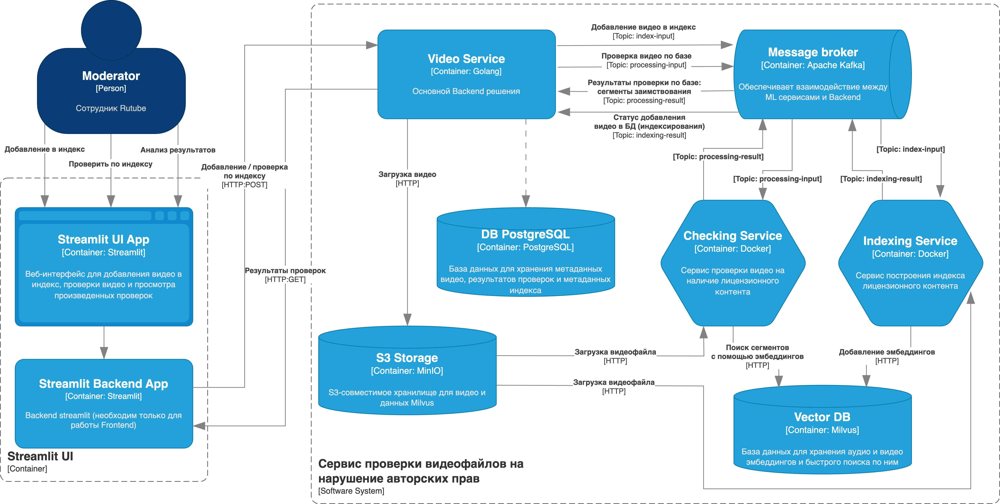
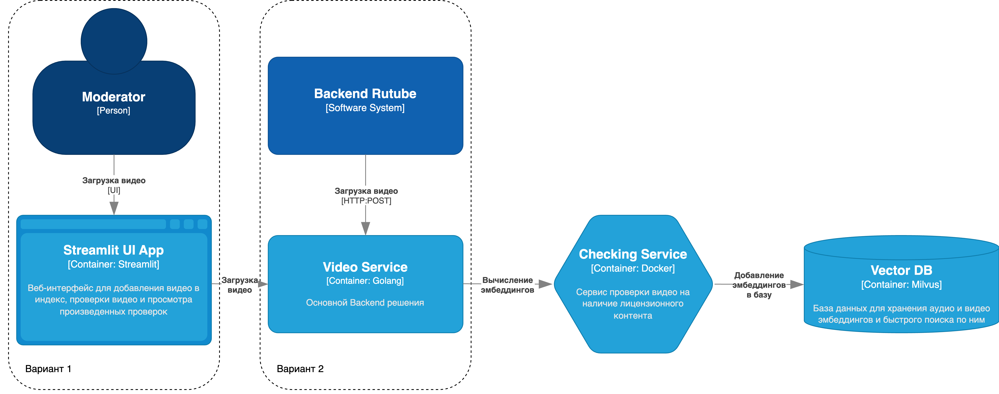
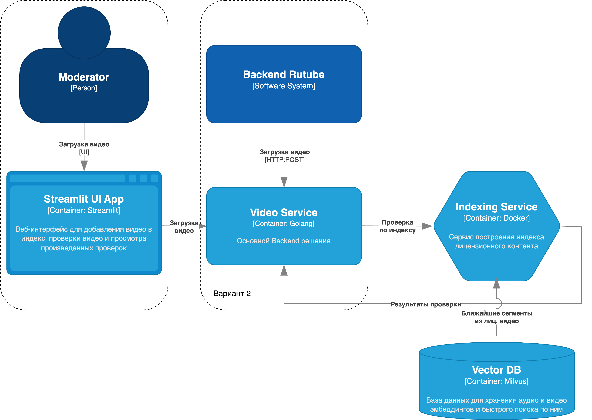

# Документация проекта

## Диаграмма работы сервиса



## Сохранение видео в Индекс



## Проверка видео на нарушение авторских прав



## Backend
Общение с фронтендом через http

## База postgres
### Таблицы
```SQL
create table index_videos
(
   id          serial
       primary key,
   uuid        varchar(255)                                                   not null,
   s3_url      varchar(255)                                                   not null,
   md5         varchar(255)                                                   not null,
   created_at  timestamp                                                      not null,
   updated_at  timestamp                                                      not null,
   added       boolean      default false                                     not null,
   bucket_name varchar(255) default 'video-service-bucket'::character varying not null,
   video_name  varchar(255)                                                   not null
);
```


```SQL
create table processing
(
   processing_id serial
       primary key,
   video_id      varchar(255)         not null,
   intervals     jsonb                not null,
   valid         boolean default true not null,
   start_at      timestamp            not null,
   end_at        timestamp            not null
);
```

```SQL
create table videos
(
   id           serial
       primary key,
   name         varchar(255)                                                   not null,
   video_id     varchar(255)                                                   not null,
   duration     integer                                                        not null,
   size         integer                                                        not null,
   is_processed boolean                                                        not null,
   s3_url       varchar(255)                                                   not null,
   md5          varchar(255)                                                   not null,
   created_at   timestamp                                                      not null,
   updated_at   timestamp                                                      not null,
   bucket_name  varchar(255) default 'video-service-bucket'::character varying not null,
   video_name   varchar(255)                                                   not null
);
```


### Setup Kafka
1 zookeeper, 1 broker, 4 topics

Index-input
- отправитель video-service,
- получатель indexing-service

Index-result
- отправитель indexing-service,
- получатель video-service

Processing-input
- отправитель video-service,
- получатель indexing-service

Processing-result
- отправитель indexing-service,
- получатель video-service
