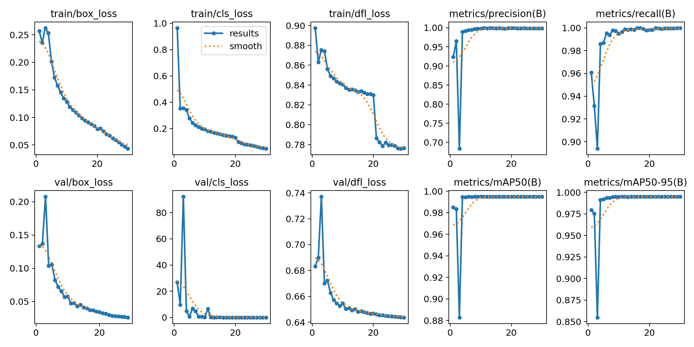

# Обучение модели распознавания Picture in Picture (PiP)

Полный пайплайн подготовки данных и обучения модели находится в файле pip_train.ipynb.

## Подготовка данных

Для обучения модели детекции картинки в картинке был сгенерирован синтетический набор данных.

В качестве исходного набора был использован открытый датасет COCO 2017 (train, val, test).
Из всех изображений были выбраны прямоугольные с соотношением сторон ближе к 16:9 (как видео в датасете).
Половина изображений использовалась как фон, остальная половина вставлялась как картинка в картинке.

Перед вставкой изображения аугментировались. Аугментации были выбраны по примерам видео из валидацонного датасета. Применялось добавление паддинга, размытия, перевод в чёрно-белое изображение и небольшой поворот.

## Модель для детекции

Для обучения модели использовалась open source библиотека ultralytics. В качестве модели была использована модель YOLOv8n, которая показала хорошую точность на синтетическом наборе данных и на реальных видео из валидационного датасета.

## Финальные метрики

Модель обучалась 30 эпох, метрики приведены ниже. Получилась достаточно хорошая модель. На валидационном датасете (видео), находит картинки в картинке практически без ошшибок с большой уверенностью (confidence > 0.9).

В сгенерированном датасете не было картинки в картинке на чёрном фоне, поэтому на таких изображениях модель работала плохо. Легко исправить, добавив данные в датасет.

